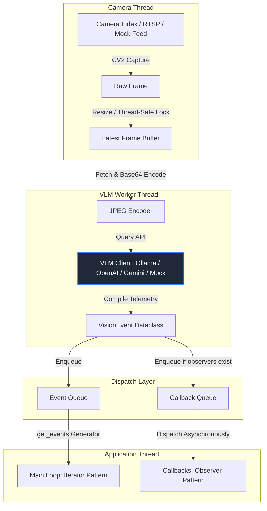

# Vision Bridge Module

A robust, highly performant, plug-and-play middleware that abstracts camera hardware, image transformations, and Vision-Language Model (VLM) inferences into a background processing pipeline. 

By running frame capture and VLM analysis on background threads, **Vision Bridge** solves OpenCV's frame-buffer latency problem and prevents async infection in your codebase. It delivers structured visual events to downstream reasoning loops with just three lines of code.

---

## Key Features 🚀

- **Zero Async Infection**: Entirely multithreaded and synchronous-friendly. No complex `async`/`await` scaffolding required.
- **Eliminates OpenCV Buffer Lag**: Maintains a dedicated camera reading thread that drops intermediate frames, guaranteeing that the model always analyzes the **absolute latest** visual frame.
- **Dual Event Patterns**:
  - **Iterator Pattern (Generators)**: Consume events naturally in a standard `for` loop.
  - **Observer Pattern (Callbacks)**: Register asynchronous callbacks that execute in a separate event-distribution thread, leaving your main thread completely free.
- **Interchangeable VLM Providers**:
  - **Ollama**: Offline, private inference using local models (e.g. `llama3.2-vision`).
  - **OpenAI**: Cloud-based processing via `gpt-4o-mini` or `gpt-4o`.
  - **Google Gemini**: Fast, highly capable cloud analysis with `gemini-1.5-flash`.
  - **Mock Simulator**: A hardware-free offline driver that generates simulated feeds and observations—perfect for CI/CD pipelines and local development.
- **Structured Visual Events**: Rather than raw text strings, the module outputs immutable `VisionEvent` objects with frame telemetry, exact timestamps, and API response latencies.
- **Resilient Reconnection**: Automatically detects camera/network disconnects and executes up to 3 automatic reconnection attempts before raising failure warnings.

---

## Installation

1. Clone this repository to your project directory.
2. Install the required dependencies:
   ```bash
   pip install -r requirements.txt
   ```
   *(Note: Core requirements require `opencv-python`. `ollama`, `openai`, and `google-generativeai` are required depending on your chosen VLM provider.)*

---

## Quickstart (3 Lines of Code) ⚡

```python
from vision_bridge import VisionBridgeModule

# 1. Initialize the module (Offline Mock Mode for zero-dependency test)
vision_layer = VisionBridgeModule(vlm_model="mock", camera_index="mock", frame_rate=1.0)

# 2. Start the analysis with a visual trigger filter prompt
vision_layer.start("Is there a hand tool visible?")

# 3. Consume events naturally
for event in vision_layer.get_events():
    print(event)
```

---

## Architecture Blueprint



---

## Interactive Examples

Run any of the ready-made examples in the `examples/` directory:

### 1. Zero-Setup Demonstration (Mock Mode)
Run the full pipeline completely offline with no hardware or API keys required:
```bash
python examples/mock_demo.py
```

### 2. Generator Stream (Iterator Pattern)
Consume visual triggers line-by-line. If a significant event is seen, it hands off the lightweight text to a heavier reasoning model:
```bash
python examples/main_generator.py
```

### 3. Asynchronous Listeners (Observer Pattern)
Register callbacks and leave your main thread free to handle other application processes:
```bash
python examples/main_observer.py
```

---

## API Reference

### `VisionBridgeModule` Initializer
```python
bridge = VisionBridgeModule(
    vlm_model="llama3.2-vision:1b",  # Model string or custom VLMClient instance
    camera_index=0,                  # System camera index, RTSP url, or "mock"
    frame_rate=2.0,                  # Inferences per second
    resolution=(448, 448),           # Image dims to downscale (optimizes bandwidth)
    provider="ollama",               # 'ollama', 'openai', 'gemini', 'mock'
    **client_kwargs                  # (e.g. api_key="sk-...", simulated_latency=0.3)
)
```

### `VisionEvent` Structure
Every event generated contains rich metadata properties:
- `frame_id` (int): Sequential frame number.
- `raw_text` (str): Text response from the VLM.
- `timestamp` (float): Epoch timestamp when the frame was read.
- `datetime` (datetime): Human-readable datetime representation.
- `response_time_ms` (float): Telemetry tracking the VLM's inference speed.
- `metadata` (dict): Context parameters including model dimensions, resolution, and VLM provider.

---

## Verification and Unit Tests

To verify the installation and run our robust mock test suite, execute:
```bash
python -m unittest discover -s tests -p "test_*.py"
```

> [!TIP]
> **Production Optimization**: In production, downscale the resolution to `(224, 224)` or `(448, 448)`. Modern VLMs perform extremely well on low-resolution grids, and reducing image dimensions significantly drops payload size and VLM latency.
